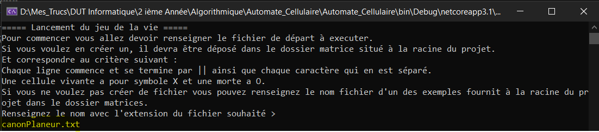
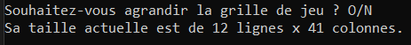
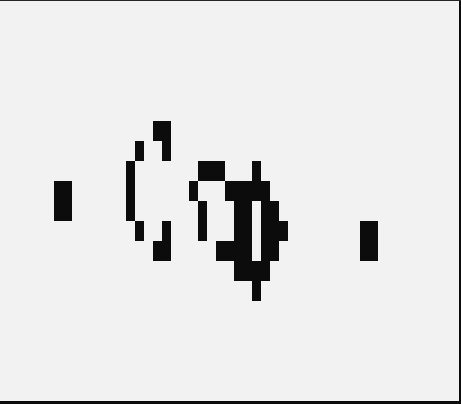

# Automate_Cellulaire

Code concernant le projet d'Algorithmie et de Gestion de Projet. Développé de A à Z par le groupe via une Analyse.

### _Fonctionnement_

Le code demande à l'utilisateur de choisir son fichier : soit il a taper ou bien il peut choisir un exemple parmis ceux-là :

* canonPlaneur.txt
* clignotant.txt
* bloc.txt
* matriceTest.txt
* planeur.txt
* grenouille.txt

Présent dans le dossier matrices se situant à la racine du projet. 

Ici canonPlaneur.txt a été choisit.

On demande ensuite si l'utilisateur veut redimensionner la grille de jeu (la ragrandir) **O** pour Oui et **N** pour Non.

Le Planeur est ensuite lancé, un **clic gauche** de la souris met sur pause l'execution et un **clic droit** remet en marche l'execution. Le programme se stop soit si l'utilisateur fait un **CTRL + C** ou si l'etat du jeu est **stable**.
